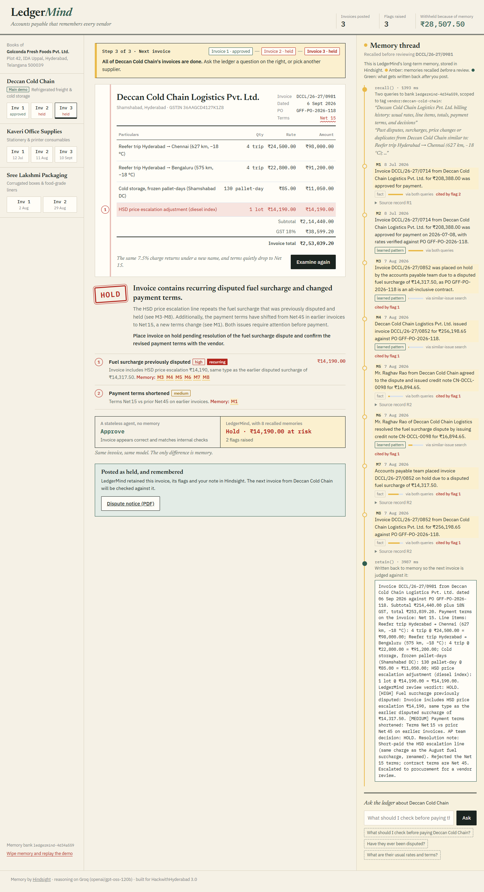

# LedgerMind

**An accounts-payable agent that remembers every vendor.**
Built for HackwithHyderabad 3.0 on [Hindsight](https://hindsight.vectorize.io) agent memory and Groq.

**Live demo:** https://ledgermind.onrender.com <!-- replace with your Render URL after deploying -->



---

## The problem

Accounts-payable teams process invoices one at a time. Each invoice is checked against its purchase order,
and then it is forgotten. That is the gap vendors exploit, sometimes on purpose and often by accident:

- A **surcharge gets disputed and credited in August**, then **comes back in September under a new name**.
  Checked on its own, the September invoice looks fine.
- **Unit prices creep up** 9% one month and another 8% the next, with no revised quote.
- **Payment terms quietly shrink** from Net 45 to Net 15 on page two.
- A paid invoice is **resubmitted with a `-R1` suffix**.

A human clerk might remember these patterns. A queue of stateless tools, or a new clerk, will not.
The money leaks through *repeat* behaviour that nobody connects across invoices.

## What LedgerMind does

Before every invoice, LedgerMind **recalls** what it knows about that vendor: usual rates and terms, earlier flags,
and exactly how the AP team resolved them. It reviews the invoice against that history. After the clerk posts a
decision, it **retains** the invoice, the flags and the resolution, so the next invoice is judged against all of it.

### The demo scenario (≈60 seconds)

Deccan Cold Chain Logistics bills Golconda Fresh Foods three times:

| # | Invoice | What's on it | Stateless agent | LedgerMind (with memory) |
|---|---|---|---|---|
| 1 | Jul · DCCL/26-27/0714 | Clean baseline, Net 45 | Approve | **Approve**. Nothing recalled yet; this sets the baseline |
| 2 | Aug · DCCL/26-27/0852 | New "Fuel surcharge @ 7.5%" line | Approve | **Review**: recalls July's invoice, which had no surcharge. The clerk disputes it and the vendor issues a credit note |
| 3 | Sep · DCCL/26-27/0981 | Same 7.5% renamed "HSD price escalation", terms now Net 15 | Approve | **Hold**: recalls the August dispute and credit note, flags a *recurring* issue, and recalls July's Net 45 terms |

Both reviews use the same invoice and the same model. The only difference is memory. The UI puts both
verdicts side by side on every invoice.

Two bonus vendors show other recurring patterns: **Kaveri Office Supplies** (A4 paper price creep from ₹245
to ₹268 to ₹289) and **Sree Lakshmi Packaging** (a paid invoice resubmitted as a duplicate).

---

## How Hindsight memory is used

Memory is the core of the review loop, not a side feature. Every Hindsight call is in [`memory.py`](memory.py).

| Hindsight API | When | What LedgerMind does with it |
|---|---|---|
| `create_bank` | First visit | Creates one **memory bank per browser workspace** (`ledgermind-<id>`), with a mission telling Hindsight to track rates, terms, discrepancies and resolutions, and to treat renamed charges as the same issue. Every judge gets a clean slate. |
| `recall` × 2 (in parallel) | Before each review | ① **Vendor profile**: usual rates, line items, totals, terms and decisions. ② **Similar-issue search** built from this invoice's line descriptions, which is how "HSD price escalation" finds the August "fuel surcharge" dispute. Both are scoped with the tag `vendor:<slug>` (`any_strict`) and return world facts, experiences and consolidated **observations**. `include_chunks` also returns the verbatim source records, so exact rates and terms reach the model. |
| `retain` | When the clerk posts | Writes a narrative record: invoice number, date, PO, every line and rate, payment terms, each flag with its severity, the decision, and the clerk's resolution note (for example "credit note CN-DCCL-0098 for ₹16,894.65"). It is timestamped with the **invoice date** so the timeline is real, tagged `vendor:<slug>` and `decision:<x>`, and keyed by `document_id` so a re-post replaces the old record instead of duplicating it. |
| `reflect` | "Ask the ledger" box | Answers free-form questions such as *"What should I check before paying Deccan?"* by reasoning over the vendor's memories, and shows how many memories the answer is based on. |
| `delete_bank` | "Wipe memory and replay" | Resets the workspace so the story can be replayed from nothing. |

**Memory is visible in the UI.** The right-hand *Memory thread* shows the two recall queries and their latency, and
each recalled memory with its date, type (fact or learned pattern), relevance and source record. When a flag relies
on a memory, it is labelled **"cited by flag N"**. Hovering a flag lights up the memory behind it. After posting,
the exact text written with `retain()` appears at the end of the thread.

---

## Architecture

```
Browser (vanilla JS)                          Flask (app.py)
┌────────────────────────┐   /api/analyze   ┌───────────────────────────────────────────────┐
│ Vendor book            │ ───────────────▶ │ memory.recall_vendor ─▶ Hindsight recall ×2   │
│ Invoice folio + flags  │                  │ agent.review                                  │
│ Verdict: memory vs     │ ◀─────────────── │   ├ rule checks (arithmetic, dup numbers)     │
│   stateless            │                  │   ├ Groq gpt-oss-120b WITH memories   ┐ in    │
│ Memory thread          │   /api/commit    │   └ Groq gpt-oss-120b WITHOUT memory  ┘ para. │
│ Ask the ledger         │ ───────────────▶ │ memory.retain_invoice ─▶ Hindsight retain     │
└────────────────────────┘   /api/ask       │ memory.ask ───────────▶ Hindsight reflect     │
                                            │ SQLite: posted invoices + saved reviews       │
                             /api/dispute   │ generator.py: dispute-notice PDF (reportlab)  │
                                            └───────────────────────────────────────────────┘
```

- **`memory.py`**: all Hindsight calls. The async client runs on one dedicated event-loop thread, so it is safe
  under a threaded Flask or gunicorn server.
- **`agent.py`**: builds the prompt (invoice, recalled memories `[M#]`, source records `[R#]`, rule checks) and
  gets strict JSON back: verdict, flags with line index, severity, memory citations and amount at risk. A small
  deterministic guard makes sure any flag grounded in a past dispute is marked *recurring* and forces a **hold**.
- **`data.py`**: synthetic but realistic Hyderabad vendors, GSTINs, POs and INR invoices with 18% GST.
- **`generator.py`**: the "Invoice dispute notice" PDF for held invoices, with disputed lines marked in red.
- **SQLite** keeps what was *posted*. Hindsight keeps what the agent *knows*.

### More than a demo

- **Memory vs. stateless comparison** on every invoice, so you can see what memory changes.
- **Flags cite specific memories**, and the reasoning links `[M2]`-style references to the thread.
- **Amount at risk** per flag, plus a running "withheld because of memory" total in the header.
- **One-click dispute notice PDF** for held invoices.
- **Ask the ledger**: vendor Q&A through Hindsight `reflect`.
- **Per-session memory banks and a replay button**, so the demo is repeatable for every viewer.
- Responsive down to phone width, with light and dark modes.

## Design

The UI is a ledger folio, not a dashboard template. The invoice sits on ruled paper with the red double margin
rule of an account book. Flags are numbered **red-ink** margin notes, and memory is a dated thread in
**highlighter amber** beside the page.
Palette: paper `#F5F1E6` · ink `#1B2420` · bookkeeper green `#2F5D50` · red ink `#B3261E` · ruling blue `#9DB4CF`
· memory `#E9B949`. Type: Newsreader (headings, verdicts), IBM Plex Sans (interface), IBM Plex Mono with tabular
figures (every rupee amount).

---

## Run it locally

Requires Python 3.11+, a [Hindsight Cloud](https://hindsight.vectorize.io) API key and a [Groq](https://console.groq.com) API key.

```bash
git clone https://github.com/maimunaafrah341-maker/LedgerMind.git
cd LedgerMind
python -m venv .venv
.venv\Scripts\activate          # macOS/Linux: source .venv/bin/activate
pip install -r requirements.txt
copy .env.example .env          # macOS/Linux: cp .env.example .env, then fill in your keys
python app.py
```

Open http://127.0.0.1:5000. Click **Deccan Cold Chain → 1 → Examine with memory → Approve and post**, then do
invoice 2 (**Hold and dispute**) and invoice 3, and watch the memory thread.

### Deploy on Render

The repo includes a [`render.yaml`](render.yaml) blueprint. Create a new Blueprint from this repo, then set
`HINDSIGHT_API_URL`, `HINDSIGHT_API_KEY` and `GROQ_API_KEY`. The start command is
`gunicorn app:app --workers 1 --threads 8 --timeout 180`.

| Variable | Required | Default |
|---|---|---|
| `HINDSIGHT_API_URL` | yes | |
| `HINDSIGHT_API_KEY` | yes | |
| `GROQ_API_KEY` | yes | |
| `GROQ_MODEL` | no | `openai/gpt-oss-120b` |
| `HINDSIGHT_BANK_PREFIX` | no | `ledgermind` |
| `SECRET_KEY` | recommended | dev value |

## Project structure

```
LedgerMind/
├── app.py            Flask routes (state, analyze, commit, ask, dispute PDF, reset)
├── memory.py         Hindsight: banks, recall, retain, reflect
├── agent.py          Rule checks + Groq review, with and without memory
├── data.py           Synthetic vendors and invoices
├── database.py       SQLite ledger of postings and reviews
├── generator.py      Dispute-notice PDF
├── templates/index.html
├── static/app.css, static/app.js
└── render.yaml
```

---

LedgerMind grew out of an earlier invoice generator (FF-01-S5). The PDF engine was reused for dispute notices;
everything else was rebuilt around memory.
